# CV
___

## About

___

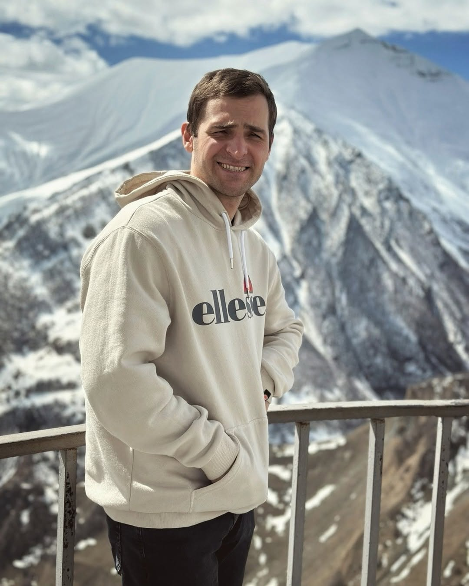

My name is Semyon, I am from a small town in the Caucasus region of Russia called Vladikavkaz, the capital of the Republic of North Ossetia-Alania. When I was a child, I wanted to become an astronaut and fly on a rocket to the International Space Station. That's why I went to study to become a rocket and space technology design engineer. But, unfortunately, not all dreams were destined to come true... In parallel with my studies, I was engaged in 3D modeling and programming, then it was just a hobby. Now I am developing computer and mobile games. I strive to improve myself, absorb more knowledge from the whole world, I develop and keep up with the times.

## Education

___

1) Bachelor's degree, BSMU «VOENMEH» n. D.F. Ustinova, Ballistics and hydroaerodynamics (2012-2016) 
2) Master's degree, BSMU «VOENMEH» n. D.F. Ustinova, Rocket and space technologies (2016-2018)

## Experiance

___

1) ISS Reshetnev: 2017-2020
2) Razor Game Studios: 2015-2024
3) 1C Game Studios: 2024-until now

## Skills

___

1) Unity, C#, Zenject (Extenject), DI, UniTask, UniRx, .NET, ECS (DOTs), OOP, Navmeshm VFX, Shader Graph, AI, DOTween, patterns, UI, Editor
2) Git, Fork, Visual Studio, Rider, Windows Forms, WPF
3) Blender, 3ds Max, ZBrush, Substance (SP, SD), Adobe (Ps, Ai, Ae, Pr), Fusion 360, SolidWorks, CATIA
4) Also familiar with (Unreal Engine, C\C++, Java, DB, Steam, Google Console, Firebase, Unity Ads)
5) Multithreading, mesh generating, procedural generating. Worked with DB, SQL query.

## Products

___

I was involved in the development and support of large projects for both mobile devices and PCs.  
  
What did I do on these projects?  
I worked on them from the very beginning until release, and then also supported them. I developed the architecture, saved and loaded large amounts of user data, worked on the user interface, worked on the procedural generation of levels and their contentá optimization.  

### The Last World (Steam)

___

[The Last World](https://store.steampowered.com/app/1927520/The_Last_World/) is a sci-fi simulation game with elements of space, modding and automation in which the player has to discover new planets and terraform them.

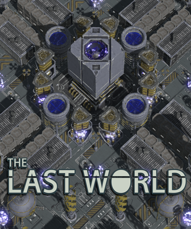

The world that we all knew and loved so well is dead. He was killed by a bacterium born in a test tube of a scientist who was trying to create a panacea - a cure for all diseases. The result is one - the disappearance of all life on the planet. On the verge of extinction, people created the "Ironborns" project - an artificial intelligence whose goal is to find a planet suitable for the existence of biological organisms in the endless ocean of stars and give a person a second chance to exist.

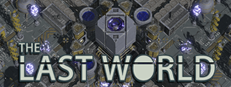

The player will have to build and develop his base, explore, trade and much more. The game features a factory mechanic where the player can produce more expensive resources for sale or upgrades. The player will extract resources from the bowels of the planets and process them to obtain components that are more expensive to manufacture. [The Last World](https://store.steampowered.com/app/1927520/The_Last_World/) is a sandbox where the player is free to choose his own path.

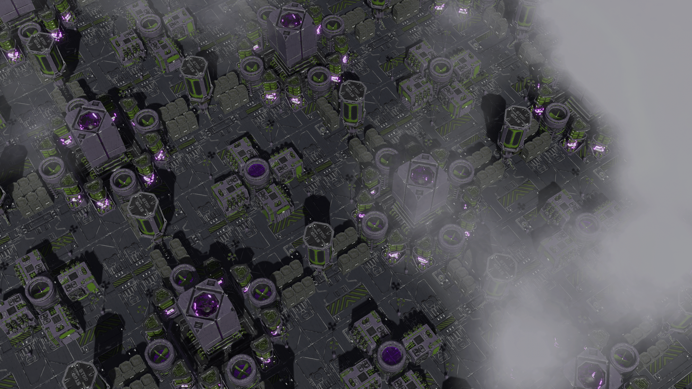

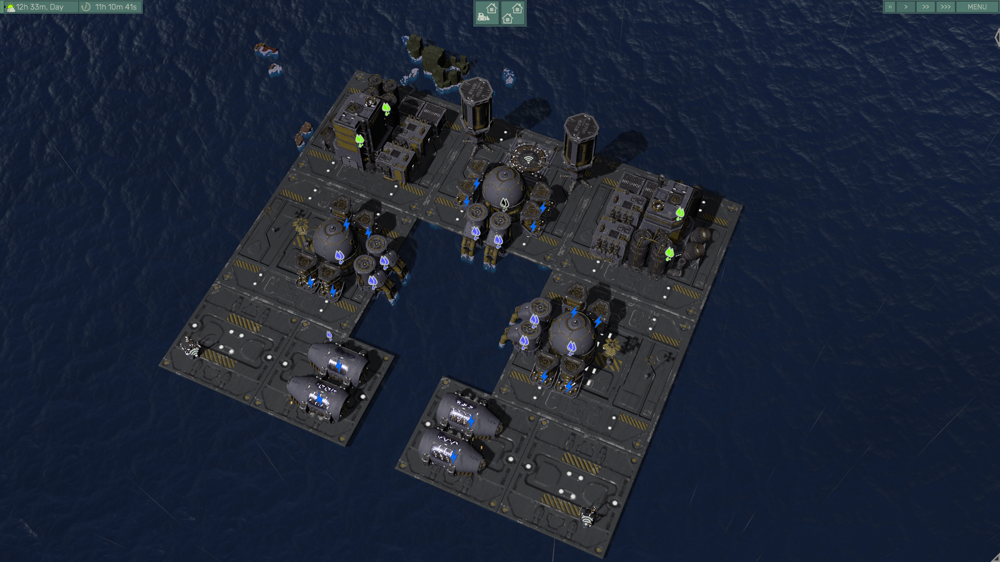

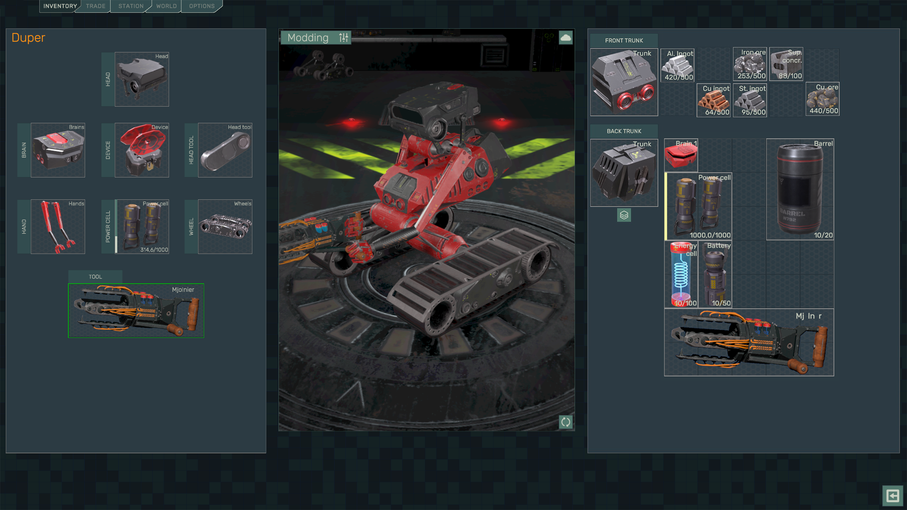

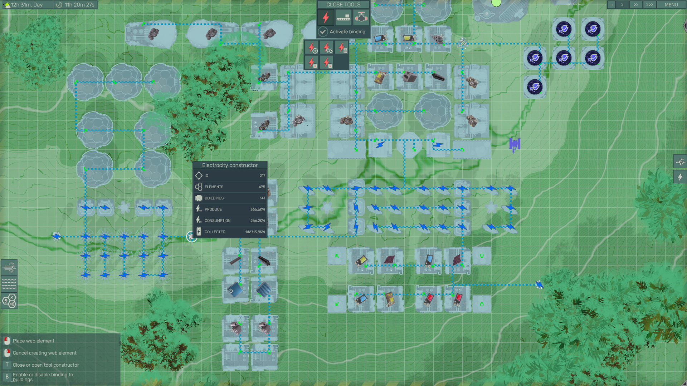

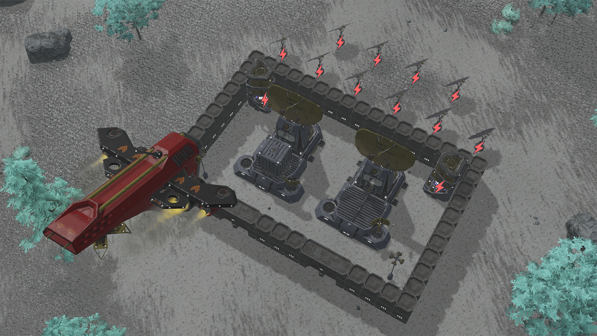

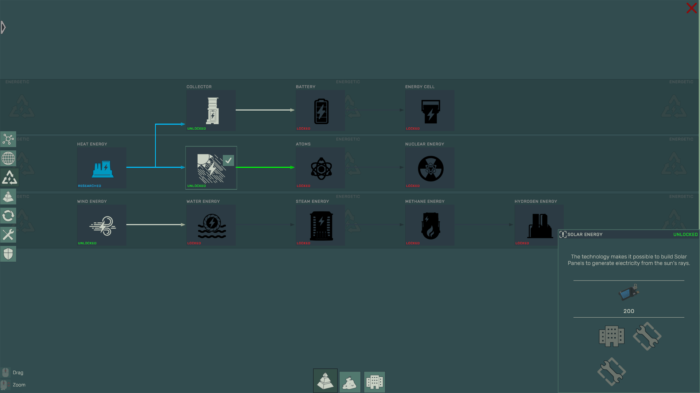

### Mining Empire: 3D Idle Tycoon (Google Play)

___

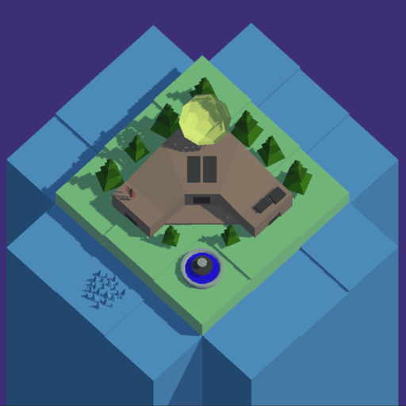

From a small mine to a giant empire - build your path to wealth...

Are you ready to get rich, leading your own industrial empire?

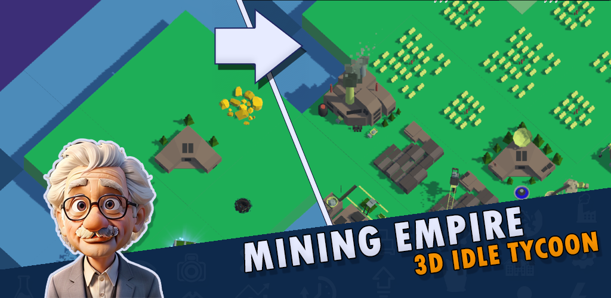

Then welcome to [Mining Empire: 3D Idle Tycoon](https://play.google.com/store/apps/details?id=com.Erochin.MiningEmpire3DIdleTycoon), where your dream of building and owning an industrial empire becomes a vivid reality. This is not just a game, it's your chance to become a true industrial tycoon and create the greatest corporation that ever existed.

Start with a small piece of land and put in more effort to turn it into a gold mine, where money flows like a river. Expand your holdings by acquiring more and more parcels of land.

Explore technologies and build more advanced factories and mines. After all you don't want to miss out on this race. Do you?

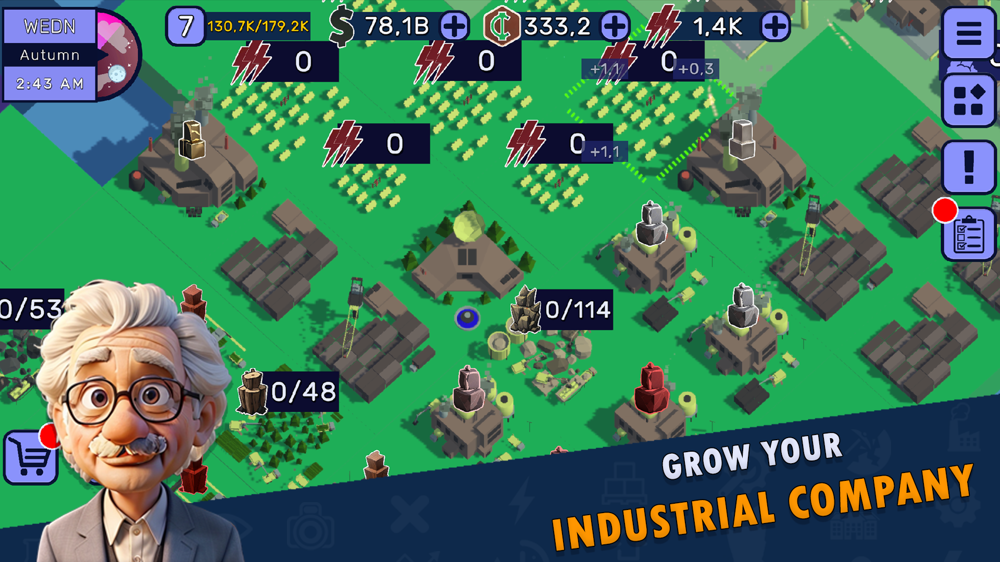

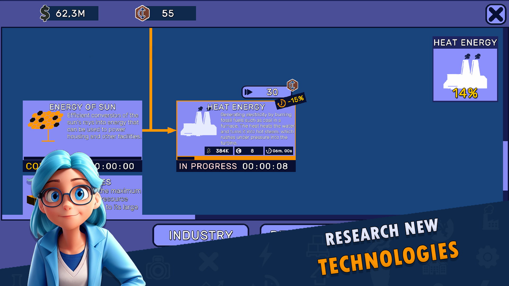

### Assets (Unity Asset Store)

___

I also integrated various SDKs (also Assets) into projects, reworked and improved some of them. I worked on visual representation of the components in the scene so that the designer would be comfortable working with them (I mean Editor). I integrated advertising, in-app purchases, events, firebase events, push notifications, coud saves.  

[Asset Store Page](https://assetstore.unity.com/publishers/18484)

#### C.O.R.E. - Game Developer's Toolkit

Read more here - [Documentations](https://mynameisvoo.github.io/COREDocumentation/)

So [C.O.R.E. - Game Developer's Toolkit](https://assetstore.unity.com/packages/slug/311902) offers developers a powerful set of tools that simplifies game creation and increases development efficiency. This asset includes all the necessary components so that you can focus on the creative process, not on routine tasks.

-   **C**  – Creation (Tools for quickly creating game objects and levels)
-   **O**  – Organization (Simplifying the organization of files and resources in a project)
-   **R**  – Rapid Development (Features that speed up the game development process)
-   **E**  – Extensibility (Support for mods and the ability to add new features)

### 3D Modeling

___

I worked on 3D models. I modeled solid props, weapons, buildings and much more. Afterwards I integrated them into Unity and configured them there.

See more here - [ArtStation](https://www.artstation.com/mynameisvoo)

## Contacts

___

E-mail choco.16mail@mail.ru 
Telegram - @samerochin

      

